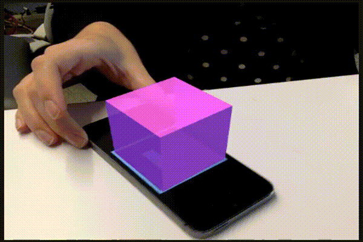

# About Arcadia, an editor for Marker-based Augmented Reality

You might be wondering what AR, or Augmented Reality, means. Well, augmented reality is defined as a real, live environment that is “augmented” by computer images. It’s a mixture of the real and the virtual.  

The bridge between our real world and our virtual world in this application will be through the use of markers. Markers are 3x3 barcodes that provide our camera with a unique ID. In this application you can have up to 16 unique markers.
Using the markers we can begin to build augmented reality experiences.

For example, see the below gif. You can see in the video that there is a purple cube that is on top of a cellphone, following as it moves. The cube is able to follow the phone because there is a marker that is displayed on the screen. The cellphone is part of the real-world, i.e. reality, and the purple cube is what we would consider a virtual object. The combination of these two gives us _augmented reality_.  

You can begin building your own AR experiences at @homeurl@. Note: this editor is currently supported in the Chrome browser which you can download [here](https://www.google.com/chrome/browser/). If you are using a mobile device only Android is supported.    
  
Here are links to some other pages to help you get started!
* [Preparing your markers](/markers)
* [Writing your first program](/program)
* [Example projects](/examples)
