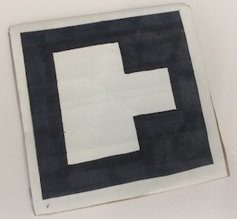

# Preparing your markers

### Materials needed
*  __Option 1:__ Printer, white printer paper & black ink _(recommended)_  
or
*  __Option 2:__ White paper, a ruler, a black marker & cardboard _(recommended if you don’t have a printer)_  
or
*  __Option 3:__ A cellphone or an electronic device that can display images  

### Option 1: Printing (recommended)
You can download high quality images of barcodes for printing here, feel free to resize them to be smaller.
Cut on the grey dashed lines so that there is white space left around the edges.
You may want to glue the marker onto a hard, flat surface such as cardboard. If the image is bent it may not be detected by the camera.

### Option 2: Drawing
TO DO --add better instructions.
Below is an image of a hand drawn marker. Notice how there is a thick black border around the 3x3 area where the barcode is, and also a white border around the whole thing. This helps provide an extra layer of contrast which helps the image recognition software to pick it up. Also, the marker is glued onto a piece of cardboard to help keep it flat and sturdy.  

### Option 3: Mobile device
Save the image of your marker onto your mobile phone or other electronic device. Open the image in your photo gallery and use this as your trackable object. Note: the screen’s reflectivity may make your marker undetectable. Try adjusting your brightness settings to achieve the best results.  

### Printable markers
Click on the value of the marker you'd like to use to get a high-quality image.

[0](static/AR_MARKER_CODES/00.png)  
[1](static/AR_MARKER_CODES/01.png)  
[2](static/AR_MARKER_CODES/02.png)  
[3](static/AR_MARKER_CODES/03.png)  
[4](static/AR_MARKER_CODES/04.png)  
[5](static/AR_MARKER_CODES/05.png)  
[6](static/AR_MARKER_CODES/06.png)  
[7](static/AR_MARKER_CODES/07.png)  
[8](static/AR_MARKER_CODES/08.png)  
[9](static/AR_MARKER_CODES/09.png)  
[10](static/AR_MARKER_CODES/10.png)  
[11](static/AR_MARKER_CODES/11.png)  
[12](static/AR_MARKER_CODES/12.png)  
[13](static/AR_MARKER_CODES/13.png)  
[14](static/AR_MARKER_CODES/14.png)  
[15](static/AR_MARKER_CODES/15.png)  
[16](static/AR_MARKER_CODES/16.png)  
[17](static/AR_MARKER_CODES/17.png)  
[18](static/AR_MARKER_CODES/18.png)  
[19](static/AR_MARKER_CODES/19.png)  
[20](static/AR_MARKER_CODES/20.png)  
[21](static/AR_MARKER_CODES/21.png)  
[22](static/AR_MARKER_CODES/22.png)  
[23](static/AR_MARKER_CODES/23.png)  
[24](static/AR_MARKER_CODES/24.png)  
[25](static/AR_MARKER_CODES/25.png)  
[26](static/AR_MARKER_CODES/26.png)  
[27](static/AR_MARKER_CODES/27.png)  
[28](static/AR_MARKER_CODES/28.png)  
[29](static/AR_MARKER_CODES/29.png)  
[30](static/AR_MARKER_CODES/30.png)  
[31](static/AR_MARKER_CODES/31.png)  
[32](static/AR_MARKER_CODES/32.png)  
[33](static/AR_MARKER_CODES/33.png)  
[34](static/AR_MARKER_CODES/34.png)  
[35](static/AR_MARKER_CODES/35.png)  
[36](static/AR_MARKER_CODES/36.png)  
[37](static/AR_MARKER_CODES/37.png)  
[38](static/AR_MARKER_CODES/38.png)  
[39](static/AR_MARKER_CODES/39.png)  
[40](static/AR_MARKER_CODES/40.png)  
[41](static/AR_MARKER_CODES/41.png)  
[42](static/AR_MARKER_CODES/42.png)  
[43](static/AR_MARKER_CODES/43.png)  
[44](static/AR_MARKER_CODES/44.png)  
[45](static/AR_MARKER_CODES/45.png)  
[46](static/AR_MARKER_CODES/46.png)  
[47](static/AR_MARKER_CODES/47.png)  
[48](static/AR_MARKER_CODES/48.png)  
[49](static/AR_MARKER_CODES/49.png)  
[50](static/AR_MARKER_CODES/50.png)  
[51](static/AR_MARKER_CODES/51.png)  
[52](static/AR_MARKER_CODES/52.png)  
[53](static/AR_MARKER_CODES/53.png)  
[54](static/AR_MARKER_CODES/54.png)  
[55](static/AR_MARKER_CODES/55.png)  
[56](static/AR_MARKER_CODES/56.png)  
[57](static/AR_MARKER_CODES/57.png)  
[58](static/AR_MARKER_CODES/58.png)  
[59](static/AR_MARKER_CODES/59.png)  
[60](static/AR_MARKER_CODES/60.png)  
[61](static/AR_MARKER_CODES/61.png)  
[62](static/AR_MARKER_CODES/62.png)  
[63](static/AR_MARKER_CODES/63.png)  

