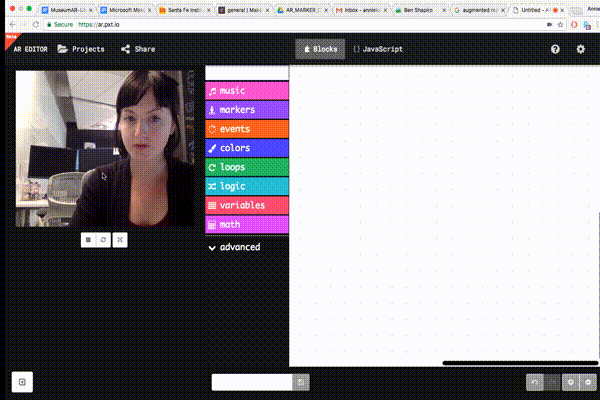
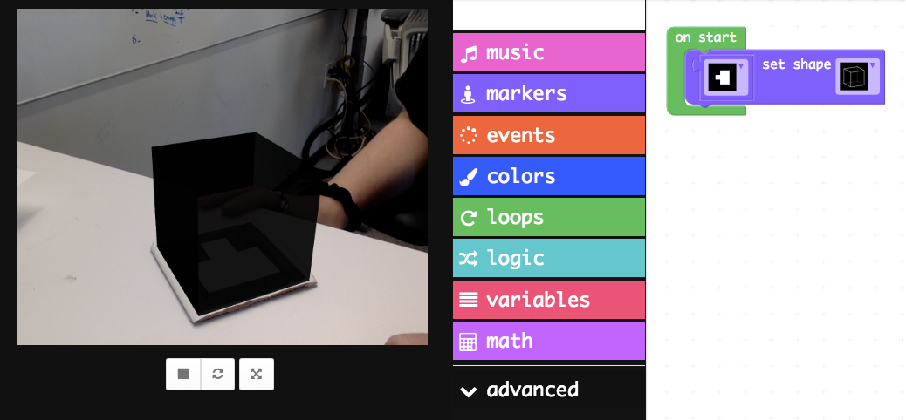

# Writing your first AR program

Open the editor at http://ar.pxt.io in Chrome. You can download Chrome here. 
  
A quick way to test if your marker is working (i.e. recognized by the application) is to try setting a shape for your marker. The on start block defines what code will run as soon as your program starts. So let’s put a set shape block inside of an on start block. Make sure you select the marker from the dropdown that matches the one you created (tip: if you hover over the image of the marker you can see what number value it corresponds to). Now, when you start your program, you should see a black shape appear on your marker when it is visible.

  

